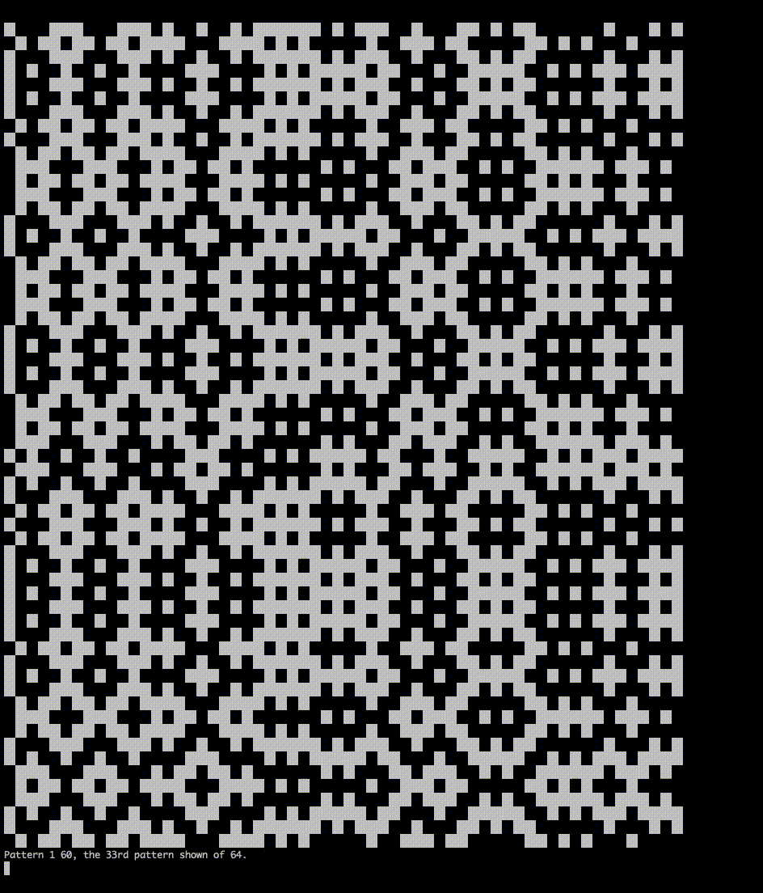

# Pattern

This project prints and records a randomly generated hitomezashi stiching pattern.

Using the `Cell`, `Grid`, and `Gridline` classes to perform logic operations and conversions.
In the `main.cpp` program, a grid is generated and then comverted to a `bitset`.
When compiled, this program should be linked to all the class files, and *requires parameters*.
Information on how to use the program may be found by running it with the flag `h f`, as in `./main h f`.
The output of the `main.cpp` program can be read by the `cat` command.

This project also contains a `many.cpp`, and a `view.cpp` file.
`many.cpp` should be compiled *on its own*, takes *no parameters*, requires a Patterns folder to be set up and the `main.cpp` file to be compiled to an executable called `main`.
`many.cpp` will call this **640 times**, each time with *different parameters*, thus generating a random collection of patterns.
`view.cpp` can then be used to randomly display 64 patterns in a sequence, like a slideshow.

## `Cell`

A `Cell` in the `Grid` knows about the `Gridline`s to each side of it.
Using a *simple logic operation* in its `get_next`, a `Cell` can tell **what colour** its neighbour should be.

This result can be plugged into the neighbour's `draw` method to change its colour.

## `Gridline`

The functions and properties of a `Gridline` are *fairly simple*.
It can randomly toggle it's *"parity,"* and tell whether it seperates two cells via its `get_edge` method.

## `Grid`

The `Grid` class stores all of the `Cell`s and `Gridline`s in `vector`s, and can convert them to a `bitset`.
The `colour` method sets all the `Cells` to follow the rules of the colouring system.
The `randomize` method randomizes the parity of all the `Gridline`s.
The `convert_to_bitset` method stores all of the data of the `Cells` in a `bitset`.

In use:

